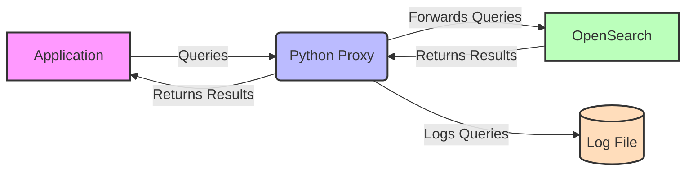

# Simple Opensearch proxy
A proxy to sit between an application an AWS Opensearch domain to log queries submitted to OpenSearch for debugging

## System Architecture



## Using the proxy

Some commands to try out the proxy are below. The commands will be logged in a file as well as passed on to the actual Elasticsearch cluster as normal.

Use the following to start the proxy and an Elasticsearch cluster:

```
docker compose up -d
```

The Proxy can be queried at http://localhost:5000

#### Create an index called "index1" with 2 shards and replication of 1:

```
curl -X PUT "http://localhost:5000/index1" -H "Content-Type: application/json" -d '{
  "settings": {
    "number_of_shards": 2,
    "number_of_replicas": 1
  }
}'
```

#### Add a simple document to index1 with field1 and field2 that contain "hello" and "world":

```
curl -X POST "http://localhost:5000/index1/_doc" -H "Content-Type: application/json" -d '{
  "field1": "hello",
  "field2": "world"
}'
```

#### Update a document to add field3 containing "new":

(First, we need to get the document ID from the previous command's response.)

```
curl -X POST "http://localhost:5000/index1/_update/5YX9pJEB4Klr3VD1QXcR" -H "Content-Type: application/json" -d '{
  "doc": {
    "field3": "new"
  }
}'
```

#### Get some documents

```
curl -X GET "http://localhost:5000/index1/_search" -H 'Content-Type: application/json' -d'
{
  "size": 10,
  "query": {
    "match_all": {}
  }
}'
```

#### Delete a field

```
curl -X POST "http://localhost:5000/index1/_update/5YX9pJEB4Klr3VD1QXcR" -H "Content-Type: application/json" -d '{
  "script": {
    "source": "ctx._source.remove(\"field2\")"
  }
}'
```

#### Delete a document

```
curl -X DELETE "http://localhost:5000/index1/_doc/5YX9pJEB4Klr3VD1QXcR"
```

## View logs

Connect to the app container and run:

```
docker exec -it python_proxy /bin/bash

cat logs/queries.log
```

#### Some example logs that would be recorded from the above commands

```
024-08-30 20:35:58,099 - 172.21.0.1 - - [30/Aug/2024 20:35:58] "GET /index1/_search HTTP/1.1" 200 -
2024-08-30 20:36:17,850 - Method: GET, Path: index1/_search, Data:
{
  "size": 10,
  "query": {
    "match_all": {}
  }
}
2024-08-30 20:36:17,881 - 172.21.0.1 - - [30/Aug/2024 20:36:17] "GET /index1/_search HTTP/1.1" 200 -
2024-08-30 20:37:51,161 - Method: POST, Path: index1/_update/1234, Data: {
  "script": {
    "source": "ctx._source.remove(\"field2\")"
  }
}
2024-08-30 20:37:51,182 - 172.21.0.1 - - [30/Aug/2024 20:37:51] "POST /index1/_update/1234 HTTP/1.1" 404 -
2024-08-30 20:37:54,142 - Method: GET, Path: index1/_search, Data:
{
  "size": 10,
  "query": {
    "match_all": {}
  }
}
2024-08-30 20:37:54,168 - 172.21.0.1 - - [30/Aug/2024 20:37:54] "GET /index1/_search HTTP/1.1" 200 -
2024-08-30 20:38:24,479 - Method: POST, Path: index1/_update/5YX9pJEB4Klr3VD1QXcR, Data: {
  "script": {
    "source": "ctx._source.remove(\"field2\")"
  }
}
2024-08-30 20:38:24,548 - 172.21.0.1 - - [30/Aug/2024 20:38:24] "POST /index1/_update/5YX9pJEB4Klr3VD1QXcR HTTP/1.1" 200 -
2024-08-30 20:38:27,242 - Method: GET, Path: index1/_search, Data:
{
  "size": 10,
  "query": {
    "match_all": {}
  }
}
2024-08-30 20:38:27,271 - 172.21.0.1 - - [30/Aug/2024 20:38:27] "GET /index1/_search HTTP/1.1" 200 -
```